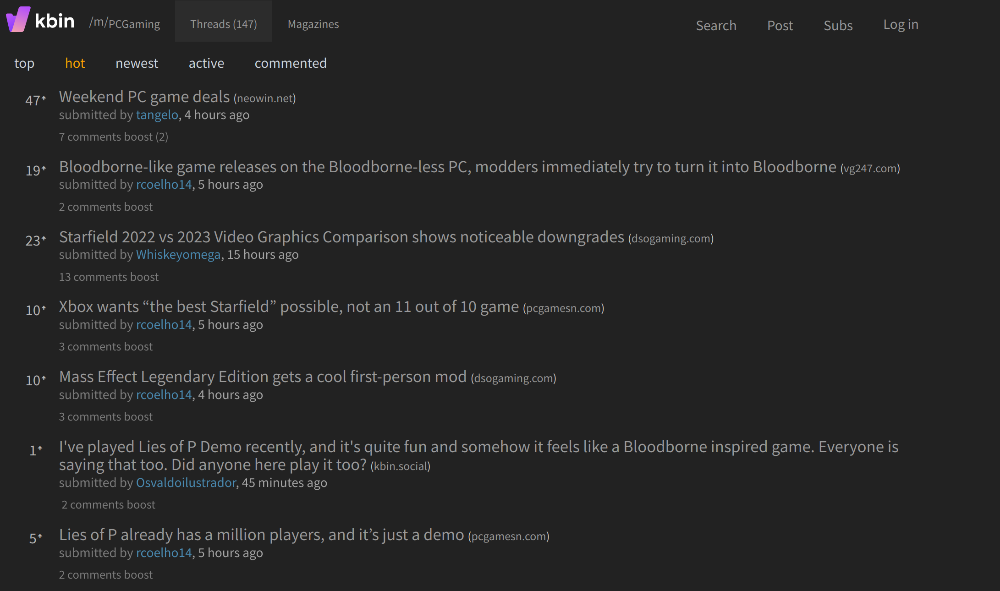

# Description

Parameterized kbin style sheet aimed at readability and decluttering.

The base theme makes some changes to the layout and starts with severable icons/widgets/features disabled, such as
avatars, thumbnails, icons, the sidebar, etc.

To enable/disable the widgets you prefer, use the radio buttons.

# Dependencies
- stylus
    - [Firefox](https://addons.mozilla.org/en-US/firefox/addon/styl-us/)
    - [Chrome](https://chrome.google.com/webstore/detail/stylus/clngdbkpkpeebahjckkjfobafhncgmne)

# Installation

Navigate to https://raw.githubusercontent.com/aclist/kbin-css/main/kbin.user.css and follow the prompts.

You can choose to customize the theme and toggle widgets on/off at this time, or do it after the fact
via the 'gear' icon from the extension's popup window on the browser toolbar.

# Usage

Settings can be changed on the fly while the page is open. Note that it may take a second for the content to update.
